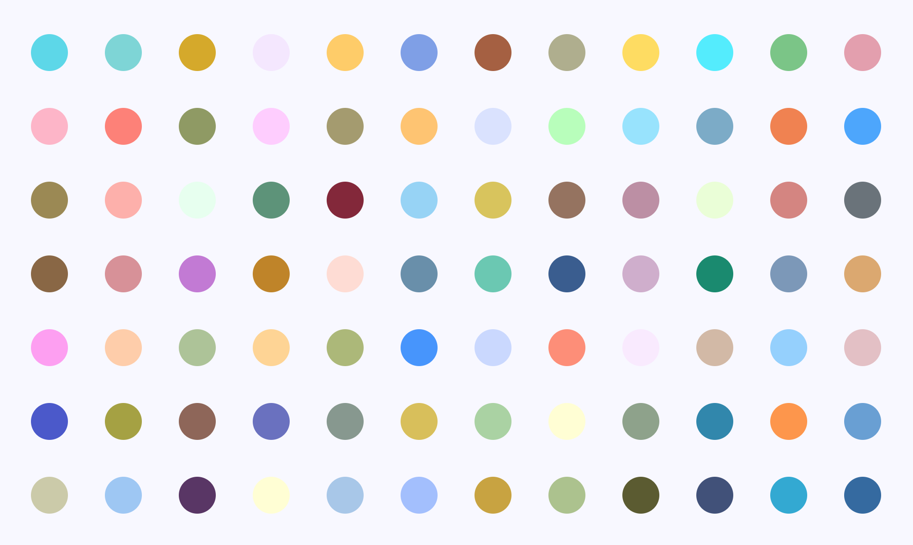

# Infinite Spots

Infinite scrolling of generated spot painting, originally by Damien Hirst. According to [Quantixed](http://quantixed.org/2018/03/26/paintballs-coming-home-generating-damien-hirst-spot-paintings/), the color palette of the artist's spots (at least in "Abalone Acetone Powder") looks like a plane in RGB color space, specifically `R/3 - 2*G/3 + B/3 = 0`. In other words, Damien Hirst does not seem to like bright greens (low R and B but high G) or magenta (high R and B but low G). With some fuzziness added, the result looks like this:

